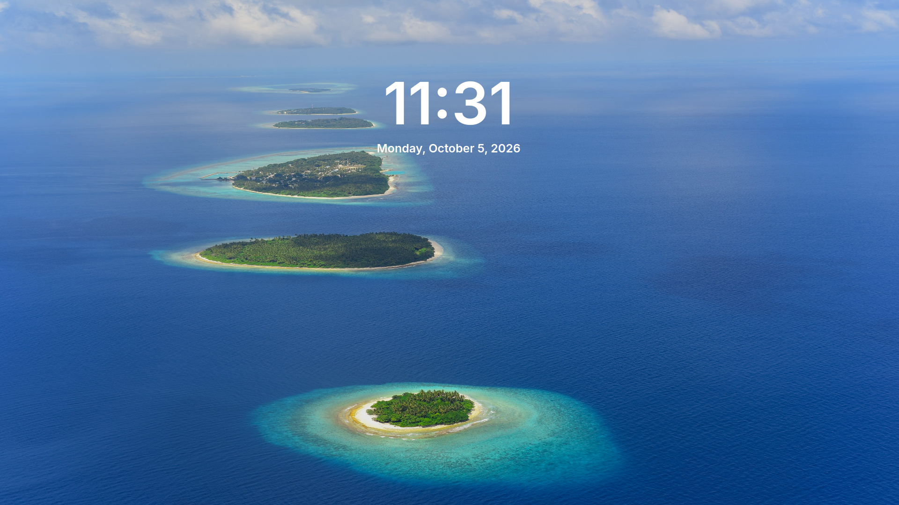

# Fenestra SDDM

A Windows 11 style login screen for SDDM, part of the **Fenestra** series for KDE Plasma.



## Features

- Windows 11 look: clock screen first, login panel on click or key press
- **12 languages**, chosen automatically from the system language:
  English, French, German, Spanish, Italian, Portuguese, Dutch, Polish, Russian, Turkish, Japanese, Chinese
- **On-screen keyboard** working on the Wayland greeter
- **Network indicator** (wired, Wi-Fi, no connection) with tooltip
- Power menu (shut down, restart, sleep) and accessibility panel
- Optional **PIN mode** (digits only, automatic login after the last digit)
- Back to the clock screen after 30 seconds without activity — the password typed so far is **cleared**
- **Random background** at every boot, without repetition (optional)
- **Add your own backgrounds** from Dolphin, through a shortcut in your Pictures folder
- Accent color choice, Inter font included (nothing to install)

## Requirements

- **KDE Plasma 6** with **SDDM** running its Qt 6 greeter on **Wayland**
- For the on-screen keyboard: the **Qt 6 Virtual Keyboard** module
  (package name depends on your distribution: `qt6-virtualkeyboard`, `qt6-qtvirtualkeyboard`…)

> Fenestra is made and tested for Wayland. X11 is not supported.

## Installation

### Option 1 – With the installer (recommended)

Download the latest release, extract it, open a terminal in the extracted folder and run:

```
sudo bash install.sh
```

The installer:

- installs the theme in `/usr/share/sddm/themes/fenestra-sddm`
- adds `/etc/sddm.conf.d/zz-fenestra-sddm.conf` (on-screen keyboard and network indicator)
- makes the `Backgrounds` folder writable by administrators (`wheel` or `sudo` group)
- asks whether you want a random background at every boot
- creates shortcuts in your Pictures folder, named in your language:
  `Wallpapers/Login screen` (login backgrounds) and `Wallpapers/Desktop` (desktop wallpapers)

Then select **Fenestra** in *System Settings → Colors & Themes → Login Screen (SDDM)*.

### Option 2 – From the KDE Store

In *System Settings → Colors & Themes → Login Screen (SDDM) → Get New…*, search for **Fenestra**.

This installs the theme only. For the on-screen keyboard and the network indicator, also copy
`extras/zz-fenestra-sddm.conf` (from the GitHub repository) into `/etc/sddm.conf.d/`.
The random background and the Pictures shortcuts are only available with the installer.

## Adding your own backgrounds

Copy JPEG images into *Pictures → Wallpapers → Login screen* (or directly into
`/usr/share/sddm/themes/fenestra-sddm/Backgrounds/`). With the random background enabled,
they are picked at the next boots. Your images are kept when you update the theme with the installer.

## Settings

Edit `/usr/share/sddm/themes/fenestra-sddm/theme.conf` as administrator:

| Setting | Effect |
|---|---|
| `PinMode` | `"on"` for PIN mode, `"off"` by default |
| `PinSize` | Number of PIN digits, 1 to 10 (`"4"` by default) |
| `background` | Background image (`Backgrounds/default.jpg` by default) |
| `color` | Accent color: remove the `#` in front of the color you want |

## Testing without logging out

```
QML_XHR_ALLOW_FILE_READ=1 sddm-greeter-qt6 --test-mode --theme /usr/share/sddm/themes/fenestra-sddm
```

## Uninstall

```
sudo bash install.sh --uninstall
```

This removes the theme, its settings file, the random background service and the
login backgrounds shortcut. Images you added to `Backgrounds` are deleted too.

## Repository contents

| Path | Purpose |
|---|---|
| `fenestra-sddm/` | The theme itself (also the KDE Store archive) |
| `extras/` | Random background script and service, SDDM settings file |
| `install.sh` | Installer and uninstaller |

## Credits

- Theme: © 2026 naykkalak – Fenestra series
- Based on [win11-sddm-theme](https://github.com/birbkeks/win11-sddm-theme) by birbkeks (GPL-3.0)
- Icons: [Fluent UI System Icons](https://github.com/microsoft/fluentui-system-icons) © Microsoft (MIT),
  network icons from [Breeze](https://invent.kde.org/frameworks/breeze-icons) © KDE (LGPL-3.0)
- Font: [Inter](https://github.com/rsms/inter) by Rasmus Andersson (SIL Open Font License 1.1)
- Backgrounds: photos by asadphoto, introspectivedsgn and Rok Romih ([Pexels](https://www.pexels.com)),
  evgenit and jplenio ([Pixabay](https://pixabay.com))

Full details in [`fenestra-sddm/CREDITS.txt`](fenestra-sddm/CREDITS.txt).

## License

**GNU General Public License v3.0** (GPL-3.0), see [`COPYING`](COPYING).
Bundled third-party files keep their own licenses, listed in the credits.
